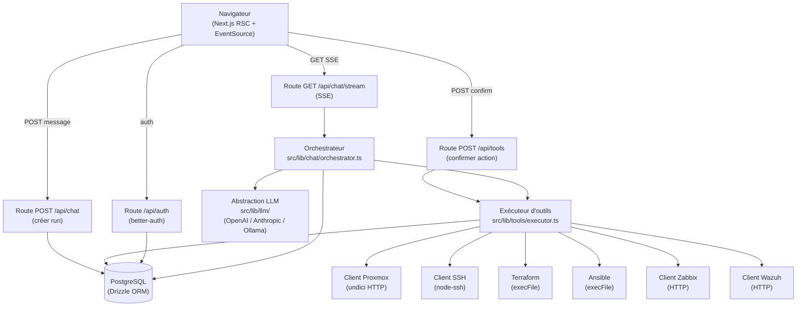
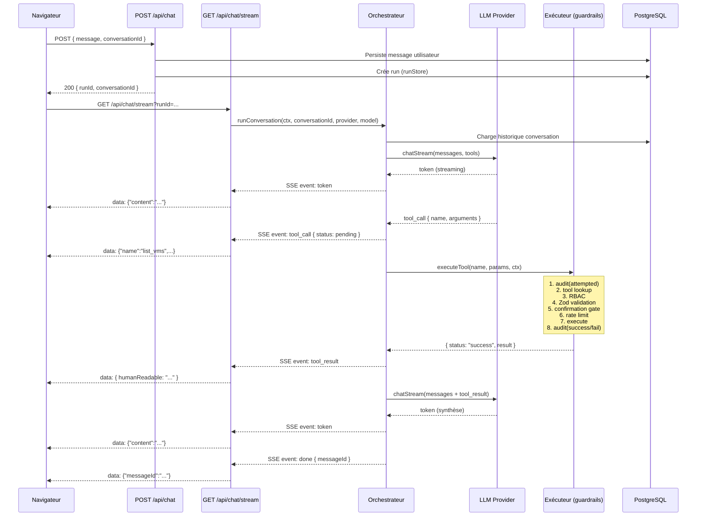
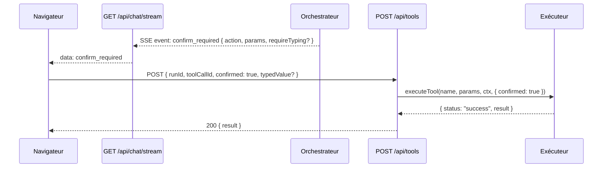

# Architecture CMDLY

## Vue d'ensemble

CMDLY est une application Next.js 16 (App Router) full-stack. Le navigateur communique avec les routes API via HTTP/SSE ; les routes API orchestrent les appels LLM et l'exécution d'outils qui s'adressent aux services d'infrastructure.

### Schéma des composants

---

## Flux d'un message (diagramme de séquence)

### Flux de confirmation (action CONFIRM_REQUIRED)

---

## Conception SSE (POST + GET)

`EventSource` (API navigateur standard) est limité aux requêtes **GET**. Or, démarrer une génération LLM nécessite de transmettre un corps JSON (message, conversationId). CMDLY résout cette contrainte par une approche en deux temps :

1. **POST /api/chat** — reçoit le message, le persiste en base, crée un `run` en mémoire (via `runStore.ts`) et retourne un `runId`.
2. **GET /api/chat/stream?runId=...** — le navigateur ouvre un EventSource sur cette URL ; la route lit le `runId`, récupère le contexte d'exécution et démarre l'orchestrateur. Les événements SSE (`token`, `tool_call`, `tool_result`, `confirm_required`, `done`, `error`) sont émis au fil du traitement.

Cette séparation garantit la compatibilité avec les navigateurs et évite d'avoir à gérer des requêtes SSE avec corps.

---

## Pipeline de garde-fous de l'exécuteur

Le fichier `src/lib/tools/executor.ts` implémente un pipeline en **8 étapes ordonnées** :

| # | Étape | Raison |
|---|---|---|
| 1 | `audit(tool_call_attempted)` | Traçabilité de toute tentative, même rejetée |
| 2 | Lookup dans le registre | Vérifie que l'outil existe |
| 3 | RBAC (`canExecuteTool`) | Contrôle d'accès basé sur le rôle avant tout traitement |
| 4 | Validation Zod des paramètres | Sanitisation avant la gate de confirmation (les paramètres validés alimentent `requireTyping`) |
| 5 | Gate de confirmation | Stoppe si confirmation requise **sans consommer de slot de débit** |
| 6 | Limite de débit | Consommée seulement après confirmation (évite les abus) |
| 7 | Exécution de l'outil | Appel effectif à l'infrastructure |
| 8 | `audit(succeeded / failed)` | Finalise la trace |

La fonction `executeTool` **ne lève jamais d'exception** — toutes les erreurs sont retournées sous forme de `ExecuteOutcome`.

---

## Convention `proxy.ts` (Next.js 16)

Next.js 16 a renommé le fichier de middleware de `middleware.ts` en `proxy.ts`. Ce fichier (`src/proxy.ts`) s'exécute sur le runtime Node.js avant chaque requête et assure :

- **Garde d'authentification** : redirige vers `/login` si la session est absente.
- **Garde d'onboarding** : redirige vers `/onboarding` si la configuration n'est pas terminée, et inverse (redirige vers `/`) si l'onboarding est déjà complété.
- **Chemins publics** : `/login`, `/api/health`, `/api/auth/*`, `/_next/*` sont exemptés.

---

## Base de données (Drizzle + PostgreSQL)

Tables principales définies dans `src/lib/db/schema.ts` :

| Table | Rôle |
|---|---|
| `users` | Comptes (better-auth + extension `role` CMDLY) |
| `sessions` | Sessions actives (24 h) |
| `accounts` / `verifications` | Tables better-auth |
| `conversations` | Conversations chat par utilisateur |
| `messages` | Messages (user / assistant / tool) avec `toolCalls` JSONB |
| `audit_log` | Journal append-only des appels d'outils |
| `infrastructure_config` | Singleton (id=1) : config Proxmox, SSH, LLM, Zabbix, Wazuh, LDAP — secrets chiffrés AES-256-GCM |
| `rate_limits` | Compteurs de débit par (userId, category) avec fenêtre glissante |

---

## Abstraction LLM multi-provider

`src/lib/llm/` expose une interface `LLMProvider` uniforme avec une méthode `chatStream()` retournant un `AsyncGenerator` d'événements (`token`, `tool_call`, `error`, `done`). Trois implémentations :

- **OpenAIProvider** (`openai.ts`) — SDK `openai`
- **AnthropicProvider** (`anthropic.ts`) — SDK `@anthropic-ai/sdk`
- **OllamaProvider** (`ollama.ts`) — bibliothèque `ollama` (modèle local)

La sélection du provider se fait à la création de la conversation via `getProvider()` dans `src/lib/llm/index.ts`, en lisant `config.defaultLlmProvider`.
